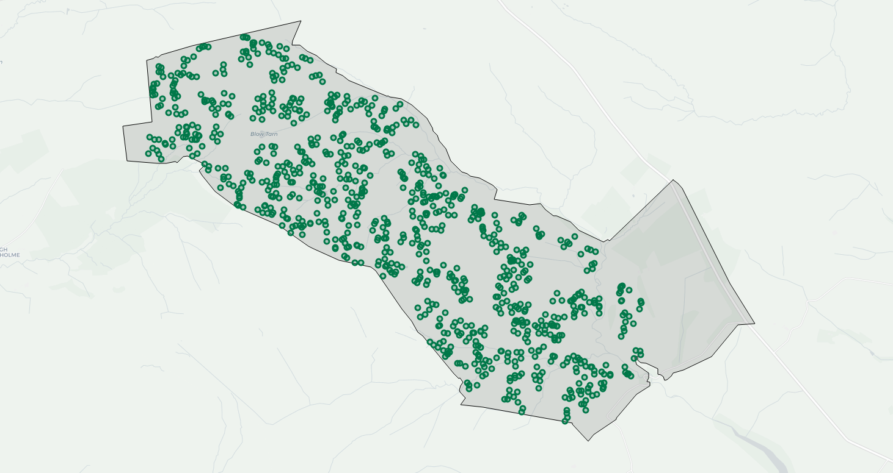

# Sampling location generator

The purpose of this program is to provide a user with a set of locations in which to conduct manual sampling of peat depth in order to optimise performance of a geostatistical model of peat depth over an area of interest.

If the user has an existing dataset of locations where they have sampled peat depth previously, the program identifies locations where additional sampling would improve the utility of the dataset.

The program is designed to ensure the sample:  
A.) Contains the number of samples desired by the user.  
B.) Has the same proportional representation of slope and elevation categories as the wider area of interest.  
C.) Ensures that each sample point is within a specified distance range of at least one other point.  

## Table of contents

1. [ Motivation. ](#motiv)
2. [ Installation. ](#install)
3. [ How to use. ](#use)
4. [ Example Usage. ](#ex)
5. [ License. ](#lic)

## Motivation
Peatlands contain a large proportion of the global soil organic carbon pool and provide vital key ecosystem services. Knowledge of the depth, and subsequently volume, of peat stored in blanket peatlands is of value. Peat depth varies over small spatial scales and capturing this varibality through either fine-scale manual sampling or geophysical techniques, such as remote sensing or ground penetrating radar, is expensive. An alternative approach involves modelling peat depth using variables known to influence peat depth, e.g. slope and elevation, which are readily available in public datasets. These models can be fitted using samples of peat depth measured manually.

Linear models of peat depth based on slope and elevation are known to perform well in areas of shallower peat found on steeper slopes; however, in areas of deeper peat the factors governing peat formation are more complex and are less-well captured by a linear model. In these cases, geostatistical models which assume spatial autocorrelation in the data are more accurate. For the benefits of geostatistical modeeling to be realised, it is essential that sampled peat depth locations are sufficiently close to one another to display spatial autocorrelation. It is also important that the range of slope and elevation values which are present are present in the data used to fit the model.

The prevailing method for manual sampling of peat depth involves taking samples at a regular distance on a uniform grid. Unfortunately, the up-shot of this is that samples tend to be too far apart for the geostatistical model to perform.

It is hoped that the creation of an easy-to-use tool would encourage practitioners to adopt a sampling approach which would facilitate more accurate modelling and mapping of peat depth.

## Installation
Usage of this tool requires installation of [Anaconda.](https://www.anaconda.com/distribution/#download-section)  
Geopandas and Shapely extension packages are required and can be installed through command line (search: "cmd") by typing:
`Pip install geopandas` and `pip install shapely`.  
Installation of these packages on Windows may fail, in which case it is recommended to:  
* Dowload Shapely from [here](https://www.lfd.uci.edu/~gohlke/pythonlibs/#shapely) according to your PC specifications and run the cmd in the folder it downloads to, typing: `pip install Shapely-1.6.4.post1-cp37-cp37m-win_amd64.whl`
* Type `conda install -c conda-forge geopandas` into the cmd for geopandas.

Using the installation procedure outlined above the program may still run into an error when attempting to convert the data projection using `to_crs`. This issue has not yet been resolved.  

## How to use
<b><ins> 1. Edit myconfig.py file </ins></b>   
Before the tool can be executed, "myconfig.py" must be edited in a text editor to provide filepaths to the following data:
* A shapefile containing a polygon outline of an area of interest. 
* Raster slope dataset (TIFF) (NB: this can cover a wider area than the AOI, it will be trimmed).
* Raster elevation dataset (TIFF) (NB: as above.)
* An existing shapefile of peat depth sample points, if it exists.  

Filepaths must also be provided for saving the outputs of the tool, which include:
* A dataframe containing the identified sampling locations. 
  * The user can choose for this dataframe to be sorted to represent the order in which the sample points should be visited so that the distance travelled between points is minimised.
* An HTML webpage containing an interactive map displaying the locations of the sample points inside the area of interest. 

The sampling constraints may also be edited, including:
* The number of samples to make.
* The distance range within which each point must be of at least another.
* The number of points within this range that each point should have.

<b><ins> 2. Run "TiffToASCii.py" </ins></b>  
This tool must be executed first as it uses the Arcpy module to convert a tiff to a ascii file. Arcpy is only available in Python 2 and so must be run seperately to the rest. This will save an ascii file in the same location and with the same name as the  TIFF files they are based on, but with an edited filetype.  

<b><ins> 3. Run "RunProgram.py" which reads in the TIFF file and identifies the sampling locations </ins></b>  
The main tool can be executed using "RunProgram.py" either using the [command line](https://www.pythoncentral.io/execute-python-script-file-shell/) or opening the [Python IDLE](https://www.pitt.edu/~naraehan/python3/getting_started_win_first_try.html) or [Spyder](https://www.spyder-ide.org/) and pressing F5.  

## Example usage
A test dataset is provided in the repository, containing all the files needed to run the program, including:
* AOI - shapefile of Area of Interest west of Pately Bridge in the Yorkshire Dales.
* ExistingPeatDepthSamples - Shapefile containing locations of an existing peat depth sample dataset.
* Dales_elevation_clip.tiff - a Raster dataset of elevation values for a wider region of the Yorkshire Dales, 5m resolution.
* Dales_slope_clip.tiff - a Raster dataset of slope values for a wider region of the Yorkshire Dales, 5m resolution.

The following sampling constraints were used:
* N_samples =
* Max_dist = 
* Min_fist = 
* N_close_points = 

The program took X minutes to create this sample:

## License
This project is licensed using the MIT license - see LICENSE.txt for further details. 
